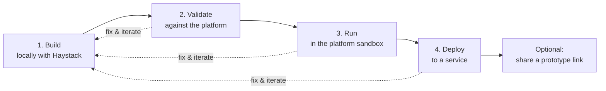

# CLI Command Flow

The deepset CLI takes a Haystack pipeline or agent that you build **locally** and moves it,
step by step, onto the Haystack Enterprise Platform. Each step builds on the previous one and
runs the **same transform** under the hood, so what you validate is what you run, and what you
run is what you deploy.

The flow is meant to be **iterative**: change your pipeline locally, re-validate, re-run, and
re-deploy as often as you like.



All commands below take the **same first argument**: the path to the local Python file that
defines your pipeline or agent (`pipeline.py` in the examples). When a file defines more than one
pipeline instance or factory, use `--entrypoint` to pick one.

> **Note on the Python environment.** Your pipeline is loaded in your project's Python
> environment (an auto-detected virtualenv near the file, or the interpreter you pass with
> `--python`). The CLI's own environment does **not** need your pipeline's dependencies installed.

---

## 1. Build your pipeline or agent locally

Build and test your pipeline or agent locally with [Haystack](https://haystack.deepset.ai/),
exactly as you normally would. No deepset CLI command is involved at this stage — you write plain
Haystack code:

```python
# pipeline.py
from haystack import Pipeline
# ... define components and wire them together ...

pipeline = Pipeline()
# pipeline.add_component(...)
# pipeline.connect(...)
```

Iterate here until the pipeline runs the way you want. Everything that follows takes this file as
its input.

---

## 2. Validate

`validate` checks that your local pipeline is **deployable**. It runs the same transform the deploy
uses (rewriting local custom components into the platform `Code` component), then validates the
resulting YAML against the platform — without deploying anything.

```shell
haystack-enterprise validate pipeline.py
```

- Prints any warnings and errors.
- Exits **non-zero** if there are blocking (ERROR) issues.
- If it reports `Pipeline is valid.`, the pipeline is deployable.

On an interactive terminal, `validate` also walks you through mapping your pipeline's inputs and
outputs to the platform's input/output sockets. You can pin that mapping in a config file
(`<target>.io.yaml`, picked up automatically next time) or supply your own with `--io-config`.

```shell
# validate a specific entrypoint with an explicit interpreter and IO config
haystack-enterprise validate pipeline.py --entrypoint my_pipeline --python .venv/bin/python --io-config pipeline.io.yaml
```

---

## 3. Run

`run` executes your local pipeline **in the platform sandbox** and prints the results back in your
terminal — again, without deploying. This is the same "run without deploying" the builder/playground
offers, so you can check real output before committing to a service.

```shell
haystack-enterprise run pipeline.py --query "What is deepset?"
```

- `--query` routes text to the sockets mapped under the pipeline's `query` input. On an interactive
  terminal you are prompted for it if you pass neither `--query` nor `--inputs`.
- `--inputs` passes explicit run inputs as JSON — a literal string or `@path/to/file.json`. The
  shape is the Haystack run inputs dict, `{"component": {"socket": value}}`. Explicit inputs are
  merged over (and win against) anything derived from `--query`.
- `--include-outputs-from` limits the result to specific components (repeat the option for several);
  defaults to all components.
- `--output` writes the result JSON to a file instead of printing it.

```shell
# run with explicit inputs from a file and save the output
haystack-enterprise run pipeline.py --inputs @inputs.json --output result.json
```

---

## 4. Deploy to a service

`deploy` pushes your pipeline as a new **revision** of a service deployment. By default it activates
the revision and waits for the rollout to finish.

```shell
# create the service if it doesn't exist, then activate and wait for the rollout
haystack-enterprise deploy pipeline.py my-service --create
```

Useful variants:

```shell
# push a revision without rolling it out
haystack-enterprise deploy pipeline.py my-service --skip-activation

# preview the transformed YAML without deploying (no API credentials needed)
haystack-enterprise deploy pipeline.py my-service --dry-run --output out.yaml
```

Common options:

- `--create` creates the service if it does not exist (Development sizing unless overridden with
  `--service-level`, `--min-replicas`, `--max-replicas`, `--cpu`, `--memory`, `--gpu`,
  `--idle-timeout`).
- `--skip-activation` pushes the revision as `PENDING` without rolling it out.
- `--skip-validation` skips the pre-deploy YAML validation (validation runs by default and aborts on
  blocking issues).
- `--io-config` / `--skip-io-validation` control the input/output mapping, same as in `validate`.

If you interrupt the command (Ctrl-C) during rollout, the rollout continues on the platform. Check
progress any time with:

```shell
haystack-enterprise service-status my-service
```

### Optional: share a prototype link

After a successful, activated deploy you can create a **shareable prototype link** that opens a chat
UI for your pipeline. On an interactive terminal you are prompted; you can also force the choice:

```shell
# deploy and create a share link that expires in 7 days, no login required
haystack-enterprise deploy pipeline.py my-service --create --share --share-expiration-days 7 --no-share-login-required
```

- `--share` / `--no-share` create or skip the link (default: prompt on an interactive terminal).
- `--share-expiration-days` sets how long the link stays valid (default 30).
- `--share-login-required` / `--no-share-login-required` control whether recipients must log in.

Sharing requires the service to be deployed, so it is only offered when the revision is activated
(not with `--skip-activation`).

---

## Iterating

Because every step reads the same local file and applies the same transform, iterating is just
re-running a command:

1. Edit `pipeline.py` locally.
2. `haystack-enterprise validate pipeline.py` — is it still deployable?
3. `haystack-enterprise run pipeline.py --query "..."` — do the results look right?
4. `haystack-enterprise deploy pipeline.py my-service` — push a new revision.

Repeat as needed. Each deploy creates a new revision of the service, so you can roll changes out
incrementally.

---

## Command reference

| Step | Command | What it does | Talks to the platform? |
| ---- | ------- | ------------ | ---------------------- |
| 1. Build | *(Haystack, no CLI)* | Build & test your pipeline/agent locally | No |
| 2. Validate | `haystack-enterprise validate pipeline.py` | Transform + validate the YAML; confirm it's deployable | Yes |
| 3. Run | `haystack-enterprise run pipeline.py --query "..."` | Transform + run in the platform sandbox, results in your terminal | Yes |
| 4. Deploy | `haystack-enterprise deploy pipeline.py my-service --create` | Push & activate a service revision; optional share link | Yes |
| — | `haystack-enterprise service-status my-service` | Check a service's current status | Yes |

> On Windows, replace `haystack-enterprise` with `python -m haystack_enterprise_sdk.cli`.

For the full list of options on any command, run it with `--help`:

```shell
haystack-enterprise deploy --help
```
