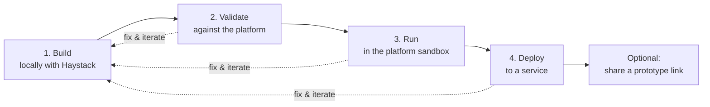

# CLI Command Flow

The deepset CLI takes a Haystack pipeline or agent that you build **locally** and moves it,
step by step, onto the Haystack Enterprise Platform. Each step builds on the previous one and
runs the **same transform** under the hood, so what you validate is what you run, and what you
run is what you deploy.

The flow is meant to be **iterative**: change your pipeline locally, re-validate, re-run, and
re-deploy as often as you like.



All commands below take the **same first argument**: the path to the local Python file that
defines your pipeline or agent (`pipeline.py` in the examples). When a file defines more than one
pipeline instance or factory, use `--entrypoint` to pick one.

> **Note on the Python environment.** Your pipeline is loaded in your project's Python
> environment (an auto-detected virtualenv near the file, or the interpreter you pass with
> `--python`). The CLI's own environment does **not** need your pipeline's dependencies installed.

---

## 1. Build your pipeline or agent locally

Build and test your pipeline or agent locally with [Haystack](https://haystack.deepset.ai/),
exactly as you normally would. No deepset CLI command is involved at this stage — you write plain
Haystack code:

```python
# pipeline.py
from haystack import Pipeline
# ... define components and wire them together ...

pipeline = Pipeline()
# pipeline.add_component(...)
# pipeline.connect(...)
```

Iterate here until the pipeline runs the way you want. Everything that follows takes this file as
its input.

---

## 2. Validate

`validate` checks that your local pipeline is **deployable**. It runs the same transform the deploy
uses (rewriting local custom components into the platform `Code` component), then validates the
resulting YAML against the platform — without deploying anything.

```shell
haystack-enterprise validate pipeline.py
```

- Prints any warnings and errors.
- Exits **non-zero** if there are blocking (ERROR) issues.
- If it reports `Pipeline is valid.`, the pipeline is deployable.

The check runs against the **`haystack-ai` version your pipeline pins**, not the platform host's own
Haystack: the transform records the version it loaded your pipeline under, and `validate` asks the
platform to run the check in a worker built for exactly that version. So a component that exists in
one version but not the other is judged by the version that will actually run your pipeline.

The first check against a given version is slow: the platform builds an environment for it (roughly
20-30s), which can outlast its own validation timeout. `validate` retries once when that happens — the
build leaves its downloads cached, so the second attempt usually lands. Later checks against the same
version are fast.

The platform only validates against a Haystack version it lists as a compatibility target, though it
will *serve* any version you pin. So if it declines your version — or the build still does not finish
in time — `validate` does not fail the pipeline: it re-runs the check against the platform's own
Haystack and prints a **warning** that the pin went unhonored, so you know version-specific problems
may have been missed.

`validate` never prompts — reporting problems is the point. It uses the input/output mapping inferred
from your socket names, so it also tells you when that mapping is not servable ("You need to connect at
least one of the inputs (`query` or `messages`)…"); `deploy` asks you to fix that interactively. You can
pin the mapping in a config file (`<target>.io.yaml`, picked up automatically) or supply your own with
`--io-config`.

```shell
# validate a specific entrypoint with an explicit interpreter and IO config
haystack-enterprise validate pipeline.py --entrypoint my_pipeline --python .venv/bin/python --io-config pipeline.io.yaml
```

---

## 3. Run

`run` executes your local pipeline **in the platform sandbox** and prints the results back in your
terminal — again, without deploying. This is the same "run without deploying" the builder/playground
offers, so you can check real output before committing to a service.

```shell
haystack-enterprise run pipeline.py --query "What is deepset?"
```

- `--query` routes text to the sockets mapped under the pipeline's `query` input. On an interactive
  terminal you are prompted for it if you pass neither `--query` nor `--inputs`. If the mapping does not
  say where a query goes, you are asked once which socket receives it — the only mapping question `run`
  ever asks, and it is skipped entirely when you pass only `--inputs`.
- `--inputs` passes explicit run inputs as JSON — a literal string or `@path/to/file.json`. The
  shape is the Haystack run inputs dict, `{"component": {"socket": value}}`. Explicit inputs are
  merged over (and win against) anything derived from `--query`.
- `--include-outputs-from` limits the result to specific components (repeat the option for several);
  defaults to all components.
- `--output` writes the result JSON to a file instead of printing it.

Unlike `validate` and `deploy`, **`run` is not pinned to the `haystack-ai` version your pipeline
declares** — the sandbox executes against the platform's own Haystack. The YAML it runs is the same one
a deploy would push, but the Haystack running it may not be, so a version-specific failure can appear
here and not in a deployed service (or the reverse). Use `validate` for the version-accurate check.

```shell
# run with explicit inputs from a file and save the output
haystack-enterprise run pipeline.py --inputs @inputs.json --output result.json
```

---

## 4. Deploy to a service

`deploy` pushes your pipeline as a new **revision** of a service deployment. By default it activates
the revision, and for a managed service it also waits for the rollout to finish.

```shell
# reuse the service (or create it serverless if it doesn't exist), then activate the revision
haystack-enterprise deploy pipeline.py my-service
```

Useful variants:

```shell
# create a managed (provisioned) service with explicit sizing
haystack-enterprise deploy pipeline.py my-service --managed --service-level PRODUCTION --cpu 2

# describe what changed in this revision
haystack-enterprise deploy pipeline.py my-service -m "Bump embedder model to bge-large"

# push a revision without rolling it out
haystack-enterprise deploy pipeline.py my-service --skip-activation

# preview the transformed YAML without deploying (no API credentials needed)
haystack-enterprise deploy pipeline.py my-service --dry-run --output out.yaml
```

Common options:

- The service is looked up by name first: if it exists the revision is pushed to it, otherwise the
  service is created and the CLI tells you so. New services are **serverless**: they provision no
  workload and run the active revision per request, so there is no rollout to wait for.
- `--create` requires that the service does *not* exist yet; the command fails if the name is already
  taken. `--no-create` is the opposite: it requires the service to exist and fails if it is missing
  (useful in CI to catch a typo'd service name instead of provisioning a new service).
- `--managed` creates a managed (provisioned) service instead. Only managed services can be sized, so
  `--service-level`, `--min-replicas`, `--max-replicas`, `--cpu`, `--memory`, `--gpu` and
  `--idle-timeout` require `--managed`; passing them without `--managed`, or passing creation-only
  flags for a service that already exists, is an error rather than a silently ignored flag.
- `--comment` / `-m` is the comment stored on the revision, so you can tell revisions apart in the
  platform UI. Every revision needs one; when you omit the flag the CLI generates a comment naming the
  pipeline file and, if it sits in a git repository, the current branch, commit and a link to the commit
  on GitHub/GitLab/Bitbucket — e.g.
  `Deployed pipeline.py via haystack-enterprise CLI (main@a1b2c3d) https://github.com/org/repo/commit/…`.
- `--skip-activation` pushes the revision as `PENDING` without rolling it out.
- `--skip-validation` skips the pre-deploy YAML validation (validation runs by default and aborts on
  blocking issues).
- `--io-config` / `--skip-io-validation` control the input/output mapping, same as in `validate`.

The platform requires a servable query pipeline to map **a query input** (`query` or `messages`) and **at
least one output**; without them it rejects the deploy. So a plain deploy asks at most those two
questions, and only for whichever one the socket names did not already answer:

```
Which socket receives the query?
  1. greeter.name (str, mandatory)
  0. not mapped
> 1
```

A pipeline with conventionally named sockets (`query`, `answers`, `replies`, `documents`) is mapped by
inference and asks nothing. Pin the mapping in `<pipeline>.io.yaml` (or `--io-config`) to skip the
questions entirely; `--share` reviews the whole mapping instead (see below).

If you interrupt the command (Ctrl-C) during rollout, the rollout continues on the platform. Check
progress any time with:

```shell
haystack-enterprise service-status my-service
```

### Calling the deployed service

Once the service is serving, `deploy` prints its OpenAI-compatible chat-completions endpoint:

```
POST https://api.cloud.deepset.ai/api/v1/workspaces/<workspace>/deployments/<deployment-id>/chat/completions
```

Send `{"model": "<workspace>/<service-name>", "messages": [...]}` with an `Authorization: Bearer` API
key and you get back a server-sent-event stream of `chat.completion.chunk` objects. Any OpenAI client
works: use everything up to and including `/deployments/<deployment-id>` as its `base_url`.

### Optional: share a prototype link

A **shareable prototype link** opens a chat UI for your pipeline. It is never created unless you ask:

```shell
# deploy and create a share link that expires in 7 days, no login required
haystack-enterprise deploy pipeline.py my-service --share --share-expiration-days 7 --no-share-login-required
```

- `--share` creates the link. Because the chat UI routes through the pipeline's input/output mapping,
  this is also what asks you to review that mapping (and offers to save it as `<pipeline>.io.yaml`).
- `--share-expiration-days` sets how long the link stays valid (default 30).
- `--share-login-required` / `--no-share-login-required` control whether recipients must log in; you are
  asked after the rollout if neither is given.

Sharing requires the service to be deployed, so `--share` cannot be combined with `--skip-activation`.
If the platform does not classify your pipeline as a chat pipeline, the link is still created but the
CLI warns that the chat UI may not render the output well — set `pipeline_output_type: chat` in the
io-config if that classification is wrong.

---

## Iterating

Because every step reads the same local file and applies the same transform, iterating is just
re-running a command:

1. Edit `pipeline.py` locally.
2. `haystack-enterprise validate pipeline.py` — is it still deployable?
3. `haystack-enterprise run pipeline.py --query "..."` — do the results look right?
4. `haystack-enterprise deploy pipeline.py my-service` — push a new revision.

Repeat as needed. Each deploy creates a new revision of the service, so you can roll changes out
incrementally.

---

## Command reference

| Step | Command | What it does | Talks to the platform? |
| ---- | ------- | ------------ | ---------------------- |
| 1. Build | *(Haystack, no CLI)* | Build & test your pipeline/agent locally | No |
| 2. Validate | `haystack-enterprise validate pipeline.py` | Transform + validate the YAML; confirm it's deployable | Yes |
| 3. Run | `haystack-enterprise run pipeline.py --query "..."` | Transform + run in the platform sandbox, results in your terminal | Yes |
| 4. Deploy | `haystack-enterprise deploy pipeline.py my-service` | Reuse or create the service (serverless, or `--managed`), push & activate a revision; optional share link | Yes |
| — | `haystack-enterprise service-status my-service` | Check a service's current status | Yes |

> On Windows, replace `haystack-enterprise` with `python -m haystack_enterprise_sdk.cli`.

For the full list of options on any command, run it with `--help`:

```shell
haystack-enterprise deploy --help
```
